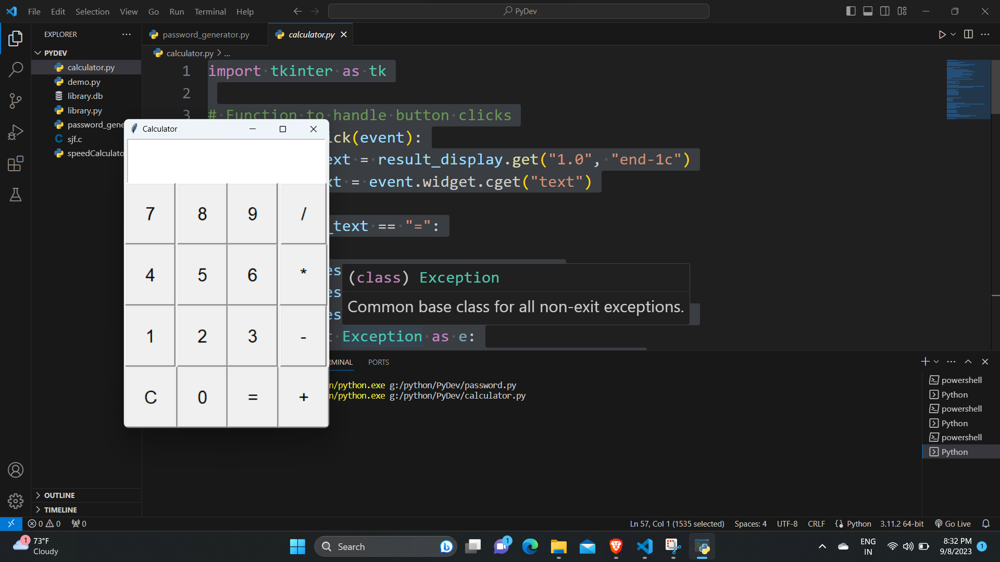

# **Project 2: Simple Calculator with Tkinter GUI in Python**

**Internship Project at CodeClause**

A Python project that implements a basic calculator with a user-friendly Tkinter GUI. This project is part of my Python development internship at CodeClause.

## Features

- User-friendly GUI for performing basic arithmetic operations.
- Addition, subtraction, multiplication, and division.
- Clear and user-friendly interface.

## Screenshot

## Demo Video

[Watch on YouTube](https://youtu.be/KUhRfnQZr60)

## Usage

1. Clone the repository.
2. Run `python calculator.py`.
3. Use the GUI to perform calculations.

## Dependencies

- Python
- Tkinter

## License

This project is licensed under the MIT License - see the [LICENSE](LICENSE) file for details.
